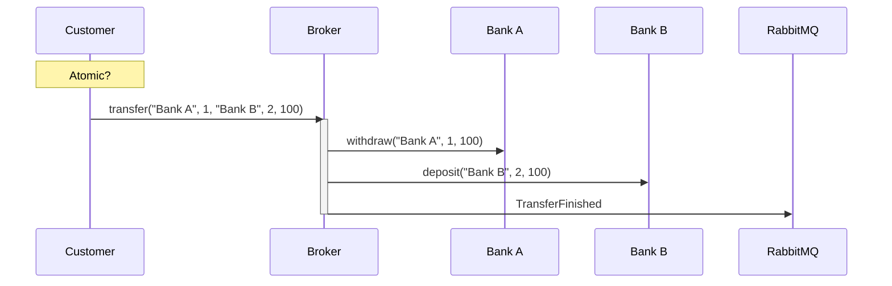
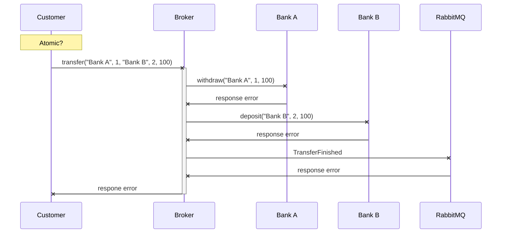
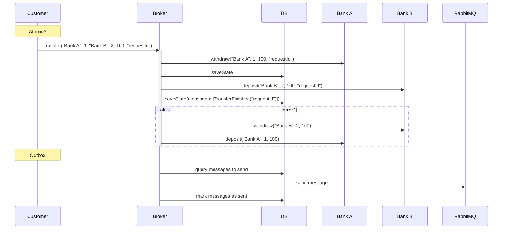
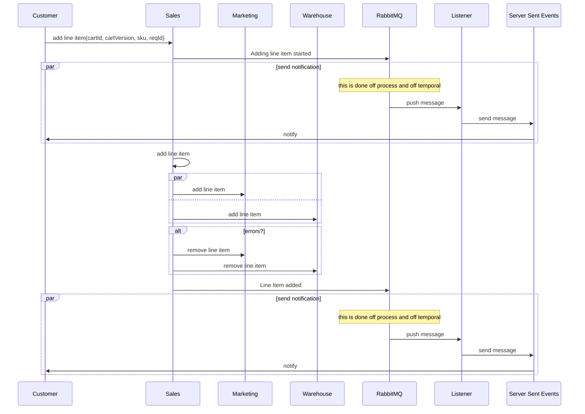

# [Temporal](https://temporal.io/) Playground

## [Bank Transfer Case Study](./banking)

This project demonstrates a broken implementation and a Temporal implementation of a bank transfer system,
structured using Hexagonal Architecture and Vertical Slices.

You can run the dependencies using the provided [docker-compose.yml](docker-compose.yml) file.

You also need the [Temporal cli](https://github.com/temporalio/cli) installed, and run
`temporal server start-dev --ui-port 8083`.

### Simple Broken Transfer

The code for the simple broken transfer can be found in [SimpleTransfer.kt](./banking/middle-bank/src/main/kotlin/com/pintomau/temporalspring/banking/middlebank/features/SimpleTransfer.kt).
The sequence diagram below illustrates the broken transfer process:



This implementation is flawed because it can lead to inconsistent states if an error occurs during the deposit process after the withdrawal has been successful.

The diagram below shows the potential failure points in the transaction:



To address these issues, we can:
1. Implement retries to handle temporary communication failures with Bank B. 
2. Ensure that operations are [idempotent](https://microservices.io/patterns/communication-style/idempotent-consumer.html) to prevent duplicate withdrawals or deposits. 
3. Store the state of the workflow at points where success was achieved, so we can resume from there in case of failures. 
4. Implement the [Saga Pattern](https://microservices.io/patterns/data/saga.html)'s compensations to undo changes in case of retries to B are unsuccessful. 
5. Use the [Outbox pattern](https://microservices.io/patterns/data/transactional-outbox.html) to guarantee that messages are sent through RabbitMQ.

In the end, it would look something like:



The Temporal implementation simplifies the solution by providing retry capabilities for the entire workflow and storing
the state of the workflow, allowing it to resume from potential failure points.
However, the implementer still needs to ensure consumer idempotency.

You can find an example Temporal implementation in [Transfer.kt](banking/middle-bank/src/main/kotlin/com/pintomau/temporalspring/banking/middlebank/features/Transfer.kt).

You can use the example requests available in [api.http](banking/middle-bank/api.http).
You can trigger these requests within IntelliJ or on your own.

When using message brokers like RabbitMQ or Kafka, the default implementation is optimistic and fire-and-forget,
which means that there is no guarantee that messages are persisted or received.
To ensure reliable messaging, read up on Publisher Confirms:
1. https://docs.spring.io/spring-cloud-stream/reference/rabbit/rabbit_overview/publisher-confirms.html
2. https://www.rabbitmq.com/tutorials/tutorial-seven-java
3. https://stackoverflow.com/questions/44992566/kafka-producer-acknowledgement

#### Idempotent consumer

We implement an overly simplified idempotent consumer by appending request IDs to a list within our account document
(using MongoDB). If we detect that a request ID has already been processed, we return the latest state of the 
account, not the response at the time the request was processed. The implementation can be found in
[AccountRepository.kt](banking/bank-a/src/main/kotlin/com/pintomau/temporalspring/banking/banka/core/AccountRepository.kt).

#### Transfer Report

We also provide an example of an always-running workflow in [TransferReport.kt](banking/middle-bank/src/main/kotlin/com/pintomau/temporalspring/banking/middlebank/features/TransferReport.kt).

## [E-Commerce case study](ecommerce)

This is just an exercise on how to achieve a more decoupled system as suggested in Mauro Servienti's 
[talk](https://youtu.be/KkzvQSuYd5I) and demos https://github.com/mauroservienti/all-our-aggregates-are-wrong-demos.

Many projects tend to create a huge Aggregate Root that contains data and drives logic from other domains.
This makes it hard for domains to be truly autonomous. The example provided in the talk is a clear example:
How can a domain that handles pricing change and notify price changes within the Cart? See the talk for the answer.

In this demo, we use Temporal to ensure that all domains are notified by changes to the cart,
driven by the sales domain.

With this example, the sales domain still needs to know which domains want to participate in a checkout, but doesn't
need to concern itself with domain logic or storage details.
An interface for the message still needs to be defined across domains.

In this example, we fan-out HTTP request to the downstream domains, but the same could be achieved using a message bus.
In this case, Temporal ensures the messages get to all consumers, concurrently, and rolls back in case an error occurs
in any of them.

Additionally, we also make use of Server Sent Events (SSE) to notify the customer of progress,
since we made this process asynchronous.
Alternatively, we could wait for the request to finish, use long polling, or use web sockets.

Idempotency is guaranteed by Sales. We also make use of Optimistic Concurrency.

The most relevant code can be found in the
[AddLineItem.kt](ecommerce/sales/src/main/kotlin/com/pintomau/temporalspring/sales/features/AddLineItem.kt)
vertical slice.

You can use the example requests available in [api.http](ecommerce/sales/api.http).
You can trigger these requests within IntelliJ or on your own.

To check the Server Sent Events, open https://localhost:8080/sales/app.

The high-level sequence looks like so:



### On compensations

In Mauro's talk, he proposes to send a generic compensation command to the consumers with the request id, such as:

`CleanUpFailedCartRequest`
```json
{
  "cartId": "{{cart-id}}",
  "requestId": "{{request-id}}"
}
```

In the example we show here, we're not as generic, and our sales domain actually knows what each other's domains'
compensation actions are.

Of course, this is just a thought exercise, and could be done either way.

On one hand, the approach shown here doesn't require downstream systems to keep a history of requests done on them.
On the other, some domain knowledge leakage may be happening here, which may have repercussions on more
involved systems.
