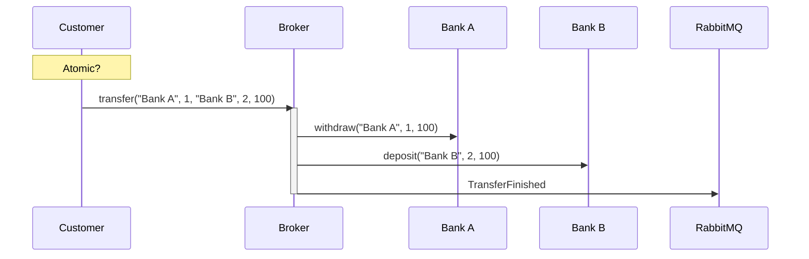
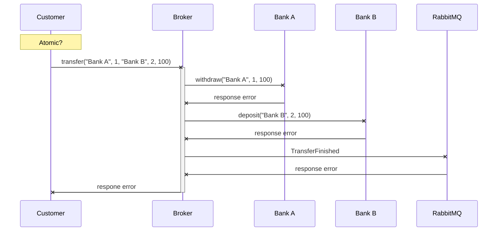
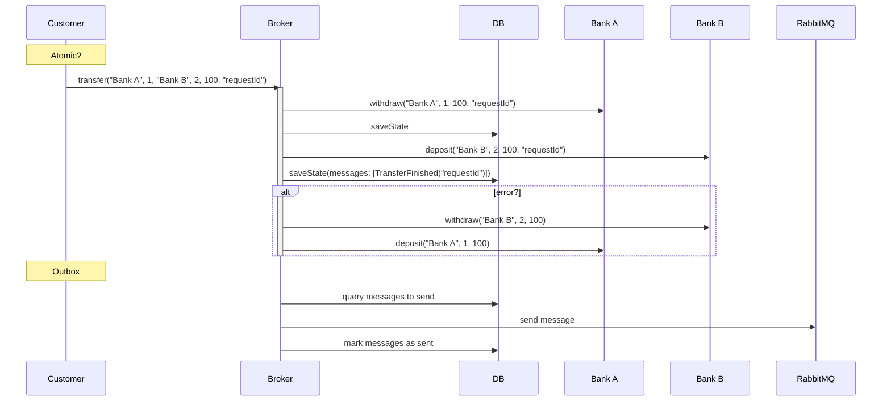

# [Temporal](https://temporal.io/) Playground

## [Bank Transfer Case Study](./banking)

This project demonstrates a broken implementation and a Temporal implementation of a bank transfer system,
structured using Hexagonal Architecture and Vertical Slices.

You can run the dependencies using the provided [docker-compose.yml](docker-compose.yml) file.

You also need the [Temporal cli](https://github.com/temporalio/cli) installed, and run
`temporal server start-dev --ui-port 8083`.

### Simple Broken Transfer

The code for the simple broken transfer can be found in [SimpleTransfer.kt](./banking/middle-bank/src/main/kotlin/com/pintomau/temporalspring/banking/middlebank/features/SimpleTransfer.kt).
The sequence diagram below illustrates the broken transfer process:

This implementation is flawed because it can lead to inconsistent states if an error occurs during the deposit process after the withdrawal has been successful.

The diagram below shows the potential failure points in the transaction:

To address these issues, we can:
1. Implement retries to handle temporary communication failures with Bank B. 
2. Ensure that operations are [idempotent](https://microservices.io/patterns/communication-style/idempotent-consumer.html) to prevent duplicate withdrawals or deposits. 
3. Store the state of the workflow at points where success was achieved, so we can resume from there in case of failures. 
4. Implement the [Saga Pattern](https://microservices.io/patterns/data/saga.html)'s compensations to undo changes in case of retries to B are unsuccessful. 
5. Use the [Outbox pattern](https://microservices.io/patterns/data/transactional-outbox.html) to guarantee that messages are sent through RabbitMQ.

In the end, it would look something like:

The Temporal implementation simplifies the solution by providing retry capabilities for the entire workflow and storing
the state of the workflow, allowing it to resume from potential failure points.
However, the implementer still needs to ensure consumer idempotency.

You can find an example Temporal implementation in [Transfer.kt](banking/middle-bank/src/main/kotlin/com/pintomau/temporalspring/banking/middlebank/features/Transfer.kt).

When using message brokers like RabbitMQ or Kafka, the default implementation is optimistic and fire-and-forget,
which means that there is no guarantee that messages are persisted or received.
To ensure reliable messaging, read up on Publisher Confirms:
1. https://docs.spring.io/spring-cloud-stream/reference/rabbit/rabbit_overview/publisher-confirms.html
2. https://www.rabbitmq.com/tutorials/tutorial-seven-java
3. https://stackoverflow.com/questions/44992566/kafka-producer-acknowledgement

#### Idempotent consumer

We implement an overly simplified idempotent consumer by appending request IDs to a list within our account document
(using MongoDB). If we detect that a request ID has already been processed, we return the latest state of the 
account, not the response at the time the request was processed. The implementation can be found in
[AccountRepository.kt](banking/bank-a/src/main/kotlin/com/pintomau/temporalspring/banking/banka/core/AccountRepository.kt).

#### Transfer Report

We also provide an example of an always-running workflow in [TransferReport.kt](banking/middle-bank/src/main/kotlin/com/pintomau/temporalspring/banking/middlebank/features/TransferReport.kt).
